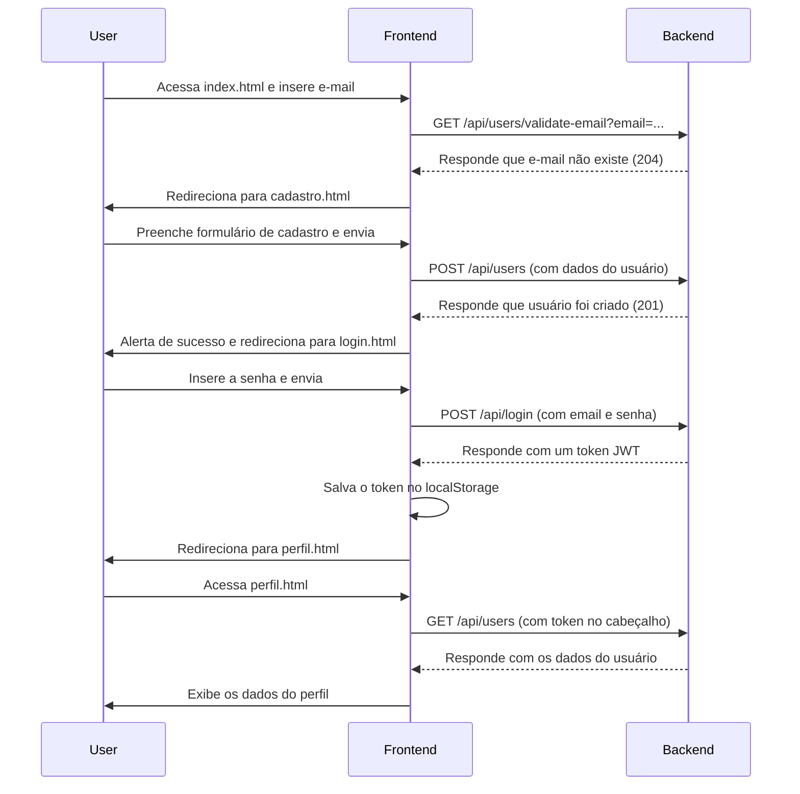

# Projeto de Cadastro e Login de Usuários

Este é um projeto simples que implementa um fluxo completo de autenticação de usuários, consistindo em um front-end em HTML, CSS e JavaScript puro, e um back-end em Node.js com Express.

## Descrição

A aplicação permite que um usuário:
- Insira um e-mail na página inicial.
- Seja direcionado para a página de **cadastro**, se o e-mail for novo.
- Seja direcionado para a página de **login**, se o e-mail já existir.
- Efetue o login para acessar uma página de **perfil** privada.
- Veja seus dados na página de perfil.
- Faça logout do sistema.

## Estrutura do Projeto

O projeto é dividido em duas partes principais:

### 1. Front-end (Pasta Raiz)

-   **`index.html`**: Página inicial onde o usuário insere o e-mail.
-   **`cadastro.html`**: Formulário para cadastro de novos usuários.
-   **`login.html`**: Formulário para login de usuários existentes.
-   **`perfil.html`**: Página que exibe os dados do usuário autenticado.
-   **`/css/style.css`**: Folha de estilos principal.
-   **`/js/`**: Contém a lógica do front-end.
    -   `api.js`: Centraliza a comunicação com o back-end.
    -   `main.js`, `cadastro.js`, `login.js`, `perfil.js`: Lógica específica de cada página.

### 2. Back-end (`/aulas-ada-master`)

-   Um servidor API construído com **Node.js** e **Express**.
-   **`index.js`**: Ponto de entrada que inicia o servidor.
-   **`/src`**: Contém a lógica da aplicação.
    -   `controllers/userController.js`: Define as rotas da API (ex: `/login`, `/users`).
    -   `app/userService.js`: Contém a lógica de negócio (criar usuário, validar senha, etc.).
    -   `middleware/auth.js`: Middleware de autenticação que valida tokens JWT.
-   **`/data`**: Onde os dados dos usuários são armazenados em um arquivo `users.json`.

## Como Executar

### Back-end

1.  **Pré-requisito**: Ter o [Node.js](https://nodejs.org/) instalado.
2.  Abra um terminal e navegue até a pasta do back-end:
    ```sh
    cd c:\Users\USUARIO\Desktop\Front-end\Ada\Modulo2\aulas-ada-master
    ```
3.  Instale as dependências (apenas na primeira vez):
    ```sh
    npm install
    ```
4.  Inicie o servidor:
    ```sh
    npm start
    ```
5.  O terminal deve exibir `Servidor rodando na porta 3000`. Mantenha este terminal aberto.

### Front-end

1.  Com o back-end rodando, abra o arquivo `index.html` em qualquer navegador web.

## Diagrama de Sequência UML (Simplificado)

O diagrama abaixo ilustra o fluxo de um novo usuário se cadastrando e fazendo login.


